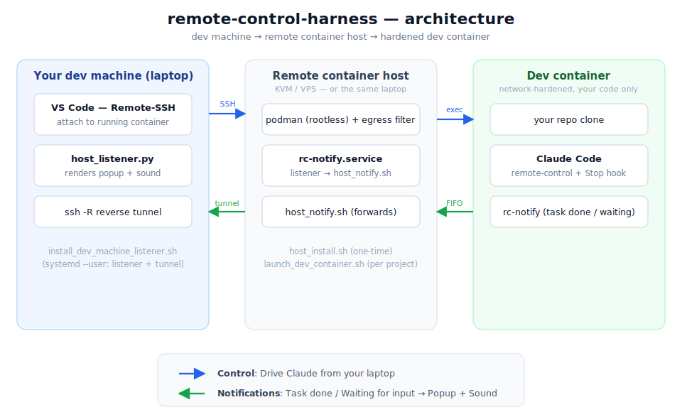

# remote-code-harness

## Overview

`remote-control-harness` runs your dev environment — including Claude Code —
inside a network-hardened, rootless **podman** container. Your real machine
stays insulated from supply-chain attacks (increasingly common), and even a
full compromise is confined to the container's blast radius.

It spans up to three tiers, and any of them can collapse onto a single machine:

1. **Your dev machine** — the laptop you sit at. Attach VS Code over SSH, drive
   Claude Code, and receive native desktop task-completion notifications.
2. **Container host** — a remote KVM/VPS ([Hetzner/AWS/DigitalOcean](docs/Running%20on%20a%20remote%20host.md))
   or the same laptop. Runs podman, the egress filter, and the notification listener.
3. **Dev container** — your repo clone + Claude Code, with enforced egress rules
   so it can only reach whitelisted hosts.

Run everything on one laptop, or push the container host onto a beefy remote box
and keep your laptop thin — the same control path and task-completion
notifications work either way. When the host is remote, you still drive Claude
from your laptop over SSH, and "task done / awaiting input" alerts tunnel back to
a popup + sound on your laptop (see
[Running on a remote host](docs/Running%20on%20a%20remote%20host.md)).



## Highlights

Each item is tagged with **where** it runs — *dev machine* (your laptop),
*container host* (the box running podman; can be the same laptop), or *dev
container* (the hardened container itself). See the diagram above.

- **[Container host]** Runs your dev containers in rootless mode using podman, cloning your code into each one.
- **[Container host]** Cross-platform: Linux (rootless + nftables) and macOS / Apple Silicon (containers inside the podman-machine VM, no host firewall changes).
- **[Container host]** Enforces egress rules that block the dev container from reaching any non-whitelisted host — with a startup self-check that the filter is actually active.
- **[Dev container]** Persists container data (repo, `node_modules`, toolchains) across restarts on a per-project volume.
- **[Dev machine]** Attach VS Code to the running container ("Attach to Running Container") — directly when the host is local, or via Remote-SSH first when it's remote.
- **[Dev container]** Claude Code pre-installed (with the NodeJS + pnpm it needs), remote-control on by default so you can drive it from your phone.
- **[Dev container]** LazyVim built in for a fully capable terminal editor (handy inside `podman exec -it <container> /bin/bash`).
- **[Dev container]** `mise` installed to set up any other toolchains you need.
- **[Container host → dev container]** Optionally mounts a host directory read-only into the container (`SHARED_DATA_PATH` in `.env`).
- **[Dev container]** Optional per-project launch hook on every container start — bring up your dev server, run migrations, warm caches, etc. (`ON_LAUNCH_SCRIPT` in `.env`).
- **[Container host]** Optionally publishes extra container ports to `127.0.0.1` for local tools (DBeaver against an in-container ClickHouse, a debugger attaching, `redis-cli`, etc.) via `EXTRA_PORTS` in `.env`.
- **[Container host]** Optionally exposes the webapp to the public internet via a Cloudflare quick tunnel (opt-in via `EXPOSE_WEBAPP` in `.env`).
- **[Container host]** On teardown, checks every repo for uncommitted / un-pushed work before taking the container down.
- **[Dev container → host → dev machine]** Built-in task-completion notifications: the container signals the host (FIFO on Linux, unix socket on macOS); when the host is remote, the host forwards to your laptop over an SSH reverse tunnel as a native popup + sound, each tagged with the project name so you can tell many containers apart.
- **[Container host → phone]** Optional mobile push via [ntfy.sh](https://ntfy.sh) alongside the desktop alert whenever Claude Code is awaiting input or finishes a task (opt-in via `ENABLE_NOTIFY_SH_ALERTS` + `NTFY_SH_TOPIC` in `.env`).

## Prerequisites

### On the container host (where podman runs — a remote box or your laptop)

- **Linux rootless mode:** `podman` 4.4+, `passt` (provides `pasta`),
  `nftables`, a working systemd `--user` session
  (`loginctl enable-linger $USER` if you're not always logged in),
  kernel ≥ 5.x with cgroup v2.
- **Linux `--rootful` mode:** `podman`, `iptables` (legacy or nft-backed),
  `sudo`.
- **macOS (Apple Silicon):** `podman` 4.4+ (`brew install podman`) and a
  podman machine in **rootful** mode — see [macOS notes](#macos-apple-silicon-notes)
  below.
- **Reverse-tunnel notifications (only if this host is remote and forwards
  alerts to a separate laptop):** the host's `sshd` must permit a reverse
  (`-R`) TCP forward for your user. Hardened hosts often ship
  `AllowTcpForwarding no`, which silently blocks it. Allow it narrowly — your
  user and the one loopback port only — in a drop-in such as
  `/etc/ssh/sshd_config.d/zz-notify-tunnel.conf`:

  ```
  Match User <your-host-user>
      AllowTcpForwarding remote
      PermitListen 127.0.0.1:8765
  ```

  then `sudo sshd -t && sudo systemctl reload ssh`. Not needed when the
  container host is your laptop. See
  [Running on a remote host](docs/Running%20on%20a%20remote%20host.md).

### On your dev machine (laptop) — only if it's separate from the host

- An SSH client with key access to the container host (you already use this
  to reach the box). Use a passphrase-less key, or an agent reachable from your
  `systemd --user` session — the tunnel runs with `BatchMode=yes`.
- VS Code with the **Remote-SSH** and **Dev Containers** extensions, to edit
  inside the container.
- `autossh` — **required** by `install_dev_machine_listener.sh` for the
  always-on task-completion notification tunnel (`sudo apt install autossh`,
  `brew install autossh`, etc.). Only needed if you want desktop notifications
  forwarded from a remote container host; the installer errors out without it.

> If your laptop **is** the container host, you only need the host
> prerequisites above — everything renders and runs locally.

### Repo access

- A deploy key with commit + pull access to the repo you want to work on. It
  lives on the **container host** and is mounted read-only into the container
  for cloning.

## Usage

### Recommended: per-project flow

**On the container host** (the box that runs podman — a remote machine or your
laptop), run the host installer once after cloning, then bootstrap each project
in its own directory:

```bash
./host_install.sh                  # one-time per host: puts create-dev-container.sh
                                   # on PATH, sets up notifications + the listener
mkdir ~/myproject && cd ~/myproject
create-dev-container.sh            # walks through repo + deploy key, writes .env,
                                   # and launches the container
```

`host_install.sh` also asks whether this host should forward task-completion
notifications to another machine (e.g. a remote box reporting back to your
laptop). If so, run `install_dev_machine_listener.sh` once **on your dev
machine (laptop)** to receive them — see
[Running on a remote host](docs/Running%20on%20a%20remote%20host.md).

### Direct: single project in place

```bash
cp sample.env .env
$EDITOR .env      # set PROJECT_NAME, REPO_URL, DEPLOY_KEY_PATH, etc.
./launch_dev_container.sh                    # rootless mode; prompts for sudo once for nft rules
./launch_dev_container.sh --rootful          # fallback mode (see Modes above)
./launch_dev_container.sh path/to/other.env  # use a different env file
./launch_dev_container.sh --rebuild-base     # rebuild the base image
./launch_dev_container.sh --reset            # wipe the persistent volume
./launch_dev_container.sh --verify           # rootless only: run an egress smoke test
./launch_dev_container.sh --update           # in-container refresh (see Updates below)
```

(`./launch.sh` still works — it's a back-compat symlink to
`launch_dev_container.sh`. The per-project flow above generates a `launch.sh`
wrapper in each project dir that calls the same engine.)

When you exit `claude` (or the container otherwise stops),
`launch_dev_container.sh` tears down the egress filter (nft table or iptables
chain, depending on mode), plus the warmup slice / podman network it installed.

**Note on mode switching:** volumes and images are stored per-mode
(rootless uses your user's podman store, `--rootful` uses root's). Switching
modes means a first-launch rebuild of the base image and an empty volume;
it does not destroy data in the other mode's store.

## macOS (Apple Silicon) notes

`launch_dev_container.sh` auto-detects macOS. Containers run inside the
podman-machine Linux VM; the egress filter is installed inside the VM via
`podman machine ssh -- sudo nft ...`. No firewall changes are made on the
macOS host itself.

First-time setup:

```bash
podman machine init
podman machine set --rootful
podman machine start
```

> **Why rootful?** Rootless podman inside the VM uses `pasta` (userspace
> networking) which bypasses the kernel's netfilter — nft rules have no
> effect. Rootful mode uses real bridge networking that goes through the
> FORWARD chain. This only affects the daemon inside the VM; on the macOS
> host you still run `podman` without sudo.

For Macs with limited RAM, configure the VM before starting:
`podman machine set --memory 4096 --cpus 2`.

- The `--rootful` flag is **not** supported on macOS (and not needed) —
  the VM boundary already provides equivalent isolation. Use the default
  invocation: `./launch_dev_container.sh`.
- If your ISP blocks outbound port 22, use the SSH-over-443 form for
  `REPO_URL`, e.g. `ssh://git@ssh.github.com:443/owner/repo.git`.
- The notification socket requires virtiofs home-directory sharing
  (default in podman machine). If disabled, container hooks fail silently
  with a warning at launch.

## More docs

### [Technical details](docs/Technical%20details.md)

- [Overview](docs/Technical%20details.md#overview) — the end-state that `./launch_dev_container.sh` produces (base image, volume, ports, egress allowlist, container posture).
- [Container capabilities](docs/Technical%20details.md#container-capabilities) — which caps are added back, why, and why it's safe.
- [Usage Modes](docs/Technical%20details.md#usage-modes) — rootless (default) vs. `--rootful` fallback.
- [Persistence](docs/Technical%20details.md#persistence) — what survives restarts, how config edits propagate, `--reset` semantics.
- [Updates](docs/Technical%20details.md#updates) — what `--update` refreshes and what it deliberately won't touch.
- [Sharing host data (read-only)](docs/Technical%20details.md#sharing-host-data-read-only) — `SHARED_DATA_PATH`.
- [Adjusting the allowlist](docs/Technical%20details.md#adjusting-the-allowlist) — when a tool hangs on network.
- [What goes where](docs/Technical%20details.md#what-goes-where) — file-by-file map of the harness.
- [Best practices](docs/Technical%20details.md#best-practices) — deploy-key scoping.

### [How to connect to container](docs/How%20to%20connect%20to%20container.md)

- [Connecting from your phone](docs/How%20to%20connect%20to%20container.md#connecting-from-your-phone) — tunneling the 127.0.0.1-bound ports.
- [Connecting from VSCode](docs/How%20to%20connect%20to%20container.md#connecting-from-vscode) — Dev Containers extension + the podman socket.
- [Claude remote-control](docs/How%20to%20connect%20to%20container.md#claude-remote-control) — `run-claude`, on-by-default remote control, pairing from your phone.

### [Running on a remote host](docs/Running%20on%20a%20remote%20host.md)

- Launching the harness on a remote Linux box (Hetzner/AWS/DO, x86_64 or aarch64) and attaching to it from your laptop's VSCode over SSH.
