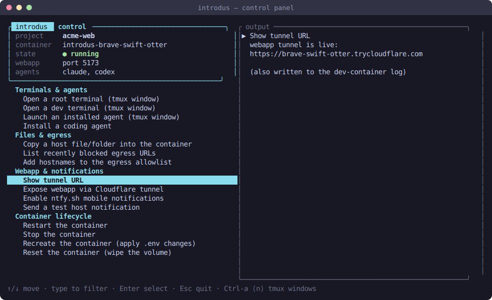
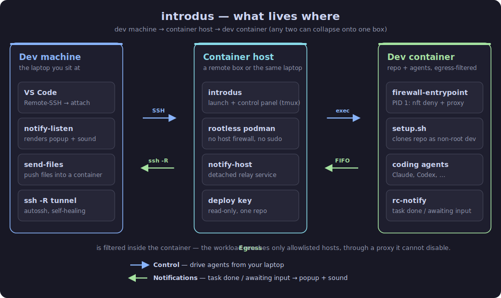

# introdus

`introdus` runs your dev environment — including AI coding agents like Claude
Code — inside a **network-hardened, rootless podman container**, so a
supply-chain compromise of your tooling is confined to the container's blast
radius instead of reaching your real machine.

The core guarantee: the workload runs as a non-root `dev` user with **no direct
internet egress**. Its only way out is a loopback hostname-allowlist proxy,
backed by a default-deny nft filter it cannot touch. A startup self-check aborts
launch if the filter isn't actually enforcing. See
[Egress filtering](docs/egress-filtering.md) and
[Container hardening](docs/container-hardening.md).



## Three tiers (any of which can collapse onto one machine)

1. **Dev machine** — the laptop you sit at. [Attach VS Code](docs/vscode.md) over
   SSH, drive the agent, receive [native notifications](docs/notifications.md).
2. **Container host** — a remote KVM/VPS or the same laptop. Runs rootless podman
   and the notification service.
3. **Dev container** — your repo clone + the agent, with
   [egress filtering](docs/egress-filtering.md) enforced *inside*.



Run it all on one laptop, or push the container host onto a
[beefy remote box](docs/remote-host.md) and keep your laptop thin — the same
control path and notifications work either way. See
[Architecture](docs/architecture.md) for the full shape.

## Quick start

Build the binary once and put it on `PATH` — do this **on the container host**
(the box that runs podman) — then work per-project:

```bash
cargo build --release              # -> target/release/introdus (one binary)
./target/release/introdus install  # copies it onto ~/.local/bin (PATH)

mkdir ~/myproject && cd ~/myproject
introdus                           # first run: setup wizard, then launches
```

The first `introdus` in a project runs the [setup wizard](docs/setup-and-configuration.md)
(repo + deploy key + agent picks), writes `.introdus/config.env`, and launches.
Later runs attach straight to that project's tmux session +
[control panel](docs/control-panel.md).

Subcommands: `introdus [launch]`, `up`, `menu`, `verify`, `recreate`, `reset`,
`update`, `rebuild-base`, `notify-host`, `notify-listen`, `send-files`,
`install`. Most are also on the control panel.

## Features

### Security core

| Feature | What it does |
| ------- | ------------ |
| [Egress filtering](docs/egress-filtering.md) | Default-deny nft filter + loopback hostname-allowlist proxy + fail-closed startup self-check — the workload can reach only the hosts you allowlist. |
| [Container hardening](docs/container-hardening.md) | Rootless podman, `--cap-drop=ALL` + a minimal add-back set, `no-new-privileges`, and a read-only per-repo deploy key. |

### Everyday workflow

| Feature | What it does |
| ------- | ------------ |
| [Setup wizard & configuration](docs/setup-and-configuration.md) | First-run wizard writes a hand-editable per-project config; full `.env` reference. |
| [Control panel](docs/control-panel.md) | A persistent two-pane TUI to drive lifecycle and every host-side utility. |
| [Coding agents](docs/coding-agents.md) | Pick which agents install (Claude, Codex, Antigravity, Opencode, Pi, Kilocode) — nothing baked into the image, installs sandboxed. |
| [Claude remote control](docs/claude-remote-control.md) | On by default — pair from claude.ai/code or your phone and drive the agent, no inbound port. |
| [Paseo orchestrator](docs/paseo.md) | Optional — run agents under a daemon and drive them from a phone/desktop/web client. |
| [Attach VS Code](docs/vscode.md) | A full VS Code window whose filesystem, terminal, and extensions live inside the container. |
| [Send files](docs/send-files.md) | A dual-pane TUI (laptop ⇆ container) to copy files into a local or remote container. |
| [Notifications](docs/notifications.md) | "Task done / awaiting input" as a native desktop popup + sound, tunnelled back from a remote host; optional phone push. |

### Container & host

| Feature | What it does |
| ------- | ------------ |
| [Persistence, lifecycle & updates](docs/persistence-and-lifecycle.md) | Per-project volume survives restarts; `recreate` / `reset` / `destroy`; in-place `update`. |
| [Public webapp tunnel](docs/webapp-tunnel.md) | Opt-in Cloudflare quick tunnel to expose the webapp on a public `*.trycloudflare.com` URL. |
| [Launch hooks](docs/launch-hooks.md) | Run your own root/dev setup on every container start — dev server, migrations, services. |
| [Host data & extra ports](docs/host-data-and-ports.md) | Read-only host-dir mount + extra `127.0.0.1`-bound published ports for local tools. |
| [Running on a remote host](docs/remote-host.md) | Push the container host to a remote Linux box and drive it from your laptop. |
| [Architecture](docs/architecture.md) | The shape of the system, image/container naming, and the source map. |

## Prerequisites

**On the container host** (where podman runs):

- **Linux rootless podman** (the only supported configuration): `podman` 4.4+,
  `pasta` (`apt install passt`), `tmux`, kernel ≥ 5.x with cgroup v2. No host
  nftables, no systemd-host requirement, no sudo — the egress filter runs inside
  each container.

**On your dev machine** (laptop) — only if it's separate from the host:

- An SSH client with key access to the host (passphrase-less, or an agent
  reachable from your `systemd --user` session — the tunnel runs `BatchMode=yes`).
- VS Code with the **Remote-SSH** and **Dev Containers** extensions.
- `autossh` (recommended) for a self-healing reverse tunnel if you want
  [notifications](docs/notifications.md) forwarded from a remote host.

**Repo access:** a deploy key with commit + pull access to the repo, scoped to
that single repo. It lives on the container host, mounted read-only.

> Hardened hosts often ship `AllowTcpForwarding no`, which blocks both remote
> notifications and VS Code Remote-SSH. The narrow per-user `sshd` allowance is in
> [Notifications → host SSH-forwarding requirement](docs/notifications.md#host-ssh-forwarding-requirement).

## Security

The threat model, the uid-segregated nft rules, IP-bypass protection, the
DNS-tunnelling residual, the capability set, deploy-key handling, and the
notification trust boundary are documented across
[Egress filtering](docs/egress-filtering.md),
[Container hardening](docs/container-hardening.md), and the canonical
[security model](agent_rules/05_security.md).

## Why "introdus"?

A tip of the hat to Greg Egan's novel *[Diaspora](https://www.gregegan.net/DIASPORA/DIASPORA.html)*.
In it, the **Introdus** is the process by which a flesher — a flesh-and-blood
human — is scanned and migrated into software, taking up life inside a *polis*:
a self-contained digital environment, insulated from the hazards of the physical
world.

The metaphor fit too well to pass up. This tool does the small, mundane version:
it moves your dev environment — your repo and the AI agents you point at it — off
your real machine and into a hardened, egress-filtered container, where whatever
they get up to stays contained.
