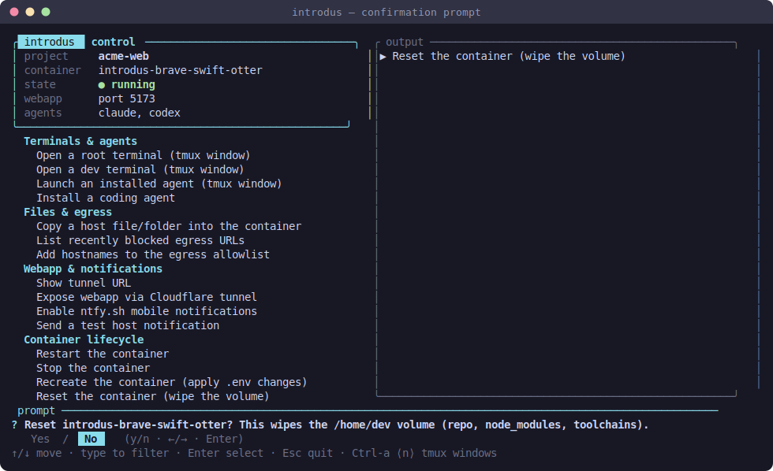

# Control panel (the TUI)

> Part of [introdus](../README.md#features). The full-screen terminal UI you drive each container from.

Every launched container lives inside one **tmux session** with a persistent
two-pane **control panel** in its `main-control` window. The left column is the
live status + a grouped, filterable menu; the right column is an output pane
where each action streams its output instead of clearing the screen. Prompts
appear as centered popups over the frame.


## Prerequisites

None beyond a launched container — the panel is what `introdus` (or `introdus
menu`) drops you into. `tmux` must be installed on the container host (it's a
[launch prerequisite](../README.md#prerequisites)).

## Usage

```bash
introdus            # launch (or re-attach to) the session + control panel
introdus menu       # attach just the control panel to an existing session
```

Inside the panel:

- **↑/↓** move the selection, **Enter** runs the highlighted action.
- **Type** to fuzzy-filter the menu; **Backspace** clears a character, **Esc**
  clears the filter or quits.
- **Ctrl-a ⟨n⟩** switches tmux windows (the prefix is remapped from `C-b` to
  `C-a`): `dev-container` is the container logs; `root-bash` / `dev-bash` /
  per-agent windows open on demand.
- While a long action runs the menu is **disabled** (dimmed, no highlight) and a
  spinner shows in the status line and footer — keystrokes are discarded so a
  mashed key can't fire a cascade of actions.

Prompts are popups: a yes/no confirm, free-text entry, or a single/multi-select
picker. Destructive actions confirm first and **default to "No"**:



### What's on the menu

| Group | Actions |
| ----- | ------- |
| **Terminals & agents** | open a root/dev terminal, launch an installed agent, [install a coding agent](coding-agents.md) |
| **Paseo** | install [paseo](paseo.md), show its pairing QR |
| **Files & egress** | copy a host file/folder in, list recently [blocked egress](egress-filtering.md) URLs, add hostnames to the [allowlist](egress-filtering.md#adjusting-the-allowlist) |
| **Webapp & notifications** | show the [tunnel URL](webapp-tunnel.md), toggle the [webapp tunnel](webapp-tunnel.md), enable [ntfy push](notifications.md#phone-push-ntfysh), send a test notification, show the notify log, restart the [notification service](notifications.md) |
| **Container lifecycle** | restart, stop, [recreate, reset, destroy](persistence-and-lifecycle.md) |
| **Menu** | refresh status, detach (keep the container running), quit (stop the container) |

Most subcommands are also available from the CLI (see the
[README](../README.md#quick-start)), but day-to-day you drive them from here.

## How it works

The panel is implemented in [panel.rs](../crates/introdus-cli/src/panel.rs): it
owns the alternate screen for the whole session and installs a
[`process::capture_stdio`](../crates/introdus-core/src/process.rs) guard so that
**every external command** an action runs (podman, tmux, ssh …) streams into the
output pane rather than the raw terminal. The menu layout and dispatch live in
[menu.rs](../crates/introdus-cli/src/menu.rs); each action's implementation is in
[menu_actions.rs](../crates/introdus-cli/src/menu_actions.rs). The shared prompt
state machines (confirm / text / picker) and status/row types are in
[ui.rs](../crates/introdus-cli/src/ui.rs) — the same primitives the one-shot
[setup wizard](setup-and-configuration.md) draws as inline modals.

The tmux session model (one session per container, its windows, and the detached
[`notify-host`](notifications.md) service) is in
[session.rs](../crates/introdus-cli/src/session.rs).
