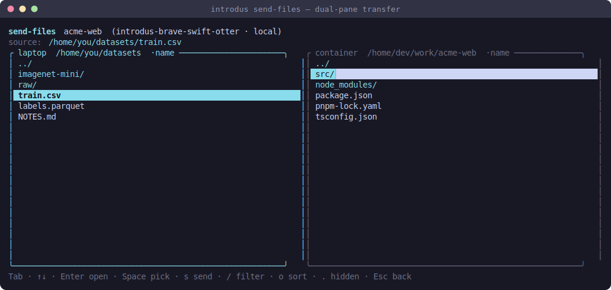

# Send files into a container

> Part of [introdus](../README.md#features). A two-pane file-transfer TUI, run from your laptop.

`introdus send-files` copies a file or folder from your laptop into a running
introdus container — local or on a remote host — through a dual-pane browser: the
laptop filesystem on the left, the container's filesystem on the right.



## Prerequisites

- Run it on the **machine that holds the files** (your laptop).
- The target container must be **running**.
- For a **remote** host, an entry in your `~/.ssh/config` with working key-based
  SSH. Git-forge aliases (a `User git` or a forge `HostName` like
  `github.com`) are filtered out of the host list automatically — they can't run
  podman.

## Usage

```bash
introdus send-files
```

1. **Pick a host** — this laptop, or a remote alias from `~/.ssh/config`.
2. **Pick a container** — the introdus containers running on that host.
3. **Browse and send** in the dual-pane view:

| Key | Action |
| --- | ------ |
| `Tab` | switch the active pane |
| `↑ ↓` / `Enter` | move / open a directory |
| `Space` | pick the highlighted file/folder on the **left** as the send source |
| `s` | send the picked source into the **right** pane's current directory |
| `/` | fuzzy-filter the current folder |
| `o` | cycle the sort (name / modified / created) |
| `.` | show/hide dotfiles (hidden by default) |
| `Esc` | back out / quit |

Each pane remembers its own scroll position, sort, filter, and hidden-file
toggle. A large copy runs behind a spinner so the UI never freezes.

## How it works

`send-files` is a standalone alternate-screen app under
[send_files/](../crates/introdus-cli/src/send_files/): the host/container pickers
and spinner in [`mod.rs`](../crates/introdus-cli/src/send_files/mod.rs), the
dual-pane browser in
[`browser.rs`](../crates/introdus-cli/src/send_files/browser.rs), and the
transfer itself in
[`transfer.rs`](../crates/introdus-cli/src/send_files/transfer.rs).

- **Local** targets copy with `podman cp`.
- **Remote** targets stream a tar over ssh into the container.

Local-vs-ssh command construction goes through
[`core::remote::Location`](../crates/introdus-core/src/remote.rs). The container
listing (`podman ps` → introdus-only containers) and directory listings
(`find -printf`, falling back to `ls`) are parsed in
[`core::containers`](../crates/introdus-core/src/containers.rs), which also owns
the sort modes and the fuzzy filter. The SSH-config host list comes from
[`core::sshconfig`](../crates/introdus-core/src/sshconfig.rs).

> To copy a file in from the **container host** itself (not your laptop), the
> control panel has a "Copy a host file/folder into the container" action that
> does the same `podman cp` locally.
