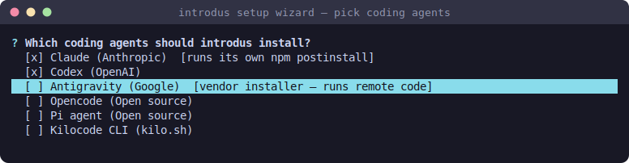

# Setup wizard & configuration

> Part of [introdus](../README.md#features). First-run setup and the per-project config file.

The first `introdus` in a project directory runs a **setup wizard** that collects
the repo, deploy key, and agent picks, writes the project's
`.introdus/config.env`, and launches. Later runs attach straight to that
project's tmux session + [control panel](control-panel.md).



## Prerequisites

- The [launch prerequisites](../README.md#prerequisites) (rootless podman +
  pasta + tmux) on the container host.
- A **deploy key** with commit + pull access to the repo you want to work on
  (the wizard can generate one for you). See
  [container hardening → deploy key](container-hardening.md#deploy-key-handling).

## Usage

```bash
mkdir ~/myproject && cd ~/myproject
introdus            # first run: wizard writes .introdus/config.env, then launches
introdus init       # (re)write the config via the wizard, without launching
```

The wizard walks:

1. **Project name / repo URL** — use the `git@…` SSH form so the deploy key is
   used for cloning.
2. **Deploy key** — generate a fresh per-project key (it prints the public key to
   add to your forge), or point at an existing one; the wizard offers candidate
   keys it finds by name.
3. **Coding agents** — a checklist of [agents](coding-agents.md) to install
   (Space toggles, Enter confirms). Higher-risk install methods are flagged
   inline.
4. **Notifications / paseo** — whether to forward
   [notifications](notifications.md) to a separate dev machine and whether to
   install [paseo](paseo.md).

You can also skip the wizard entirely and write the config by hand — copy
[sample.env](../sample.env) to `.introdus/config.env` and fill it in.

> Projects created before the config moved under `.introdus/` keep a top-level
> `./.env`; introdus reads it and offers a one-time relocation into
> `.introdus/config.env` on the next interactive launch.

## Configuration reference

The config file is a typed `Config` ⇄ env-format round-trip (parsed with
`dotenvy`), hand-editable, and normalized by the wizard/TUI on save. Full,
commented defaults live in [sample.env](../sample.env).

| Variable | Purpose |
| -------- | ------- |
| `PROJECT_NAME` | Human-readable name; drives the container name + workdir. |
| `REPO_URL` | Git repo to clone (use the `git@…` form). |
| `DEPLOY_KEY_PATH` | Absolute host path to the private [deploy key](container-hardening.md#deploy-key-handling). |
| `WEBAPP_PORT` | Port the webapp binds to inside the container (published to `127.0.0.1`). |
| `INSTALL_AGENTS` | Space-separated [agent](coding-agents.md) ids to install (`""` = none). |
| `INSTALL_PASEO` | Install the [paseo](paseo.md) orchestrator. |
| `WHITELIST_HOSTS` | The [egress allowlist](egress-filtering.md) — hostnames the proxy may reach. |
| `INTERNAL_ALLOW_CIDRS` | Fixed internal targets reachable [directly by IP](egress-filtering.md#internal-targets-by-ip). |
| `ON_LAUNCH_SCRIPT` / `ON_LAUNCH_ROOT_SCRIPT` | [Launch hooks](launch-hooks.md) run on every start. |
| `SHARED_DATA_PATH` | Host dir mounted [read-only](host-data-and-ports.md#sharing-host-data-read-only) into the container. |
| `EXTRA_PORTS` | Additional [ports](host-data-and-ports.md#extra-ports) to publish to `127.0.0.1`. |
| `EXPOSE_WEBAPP` | Expose the webapp via a [Cloudflare tunnel](webapp-tunnel.md). |
| `ENABLE_NOTIFY_SH_ALERTS` / `NTFY_SH_TOPIC` | [Phone push](notifications.md#phone-push-ntfysh) via ntfy.sh. |
| `RC_FORWARD_ADDR` | Forward [notifications](notifications.md) to a remote dev machine. |
| `MEM_LIMIT` / `CPU_LIMIT` / `PIDS_LIMIT` | Container resource caps (defaults 8g / 8 / 16384). |
| `IMAGE_SUFFIX` / `SESSION_NAME` | Per-project image/container suffix and tmux session name (auto-generated). |
| `CANARY_BLOCKED_IP` | IP the [egress self-check](egress-filtering.md#startup-self-check) dials to prove the filter drops. |

> `podman run` flags (caps, volumes, env, published ports, limits) are frozen at
> container-create time. Changing a run-affecting variable needs a
> [`introdus recreate`](persistence-and-lifecycle.md) to take effect;
> allowlist/hook changes apply on a plain relaunch.

## How it works

The wizard is in [wizard.rs](../crates/introdus-cli/src/wizard.rs) (inline
ratatui modals from [ui.rs](../crates/introdus-cli/src/ui.rs)); config parsing
and the typed round-trip are in
[config.rs](../crates/introdus-core/src/config.rs) /
[env_file.rs](../crates/introdus-core/src/env_file.rs). Per-project config-path
resolution (`.introdus/config.env`, the legacy `./.env` fallback, and the
migration offer) lives in [context.rs](../crates/introdus-cli/src/context.rs).
The dev-machine `notify-listen` settings live separately at
`$XDG_CONFIG_HOME/introdus/notify-listen.env`.
